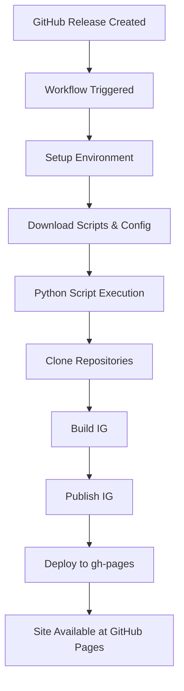

# FHIR Implementation Guide Release Pipeline

## Overview

This release pipeline automates the building and publishing of FHIR Implementation Guides (IGs) to GitHub Pages for preview. It uses the HL7 FHIR IG Publisher tool to transform source content into a fully rendered website.

## Architecture

### Components

1. **GitHub Actions Workflow** (`release.yml`)
   - Reusable workflow that can be called by multiple repositories
   - Sets up the build environment and orchestrates the process

2. **Python Script** (`ig_publisher.py`)
   - Core automation script that manages the entire build/publish process
   - Handles repository cloning, building, publishing, and deployment

3. **External Dependencies**
   - HL7 FHIR IG Publisher (Java JAR)
   - WHO/smart-html templates repository
   - HL7 fhir-ig-history-template
   - FHIR ig-registry

## How It Works

### Workflow Execution Flow



### Python Script Operations

The `ig_publisher.py` script performs these key operations:

#### 1. **Prepare Phase** (`prepare()`)
   - Clones/updates required repositories:
     - Source repository (your IG content)
     - Webroot template (WHO smart-html)
     - History template (HL7 template)
     - IG Registry (FHIR registry)
   - Downloads FHIR IG Publisher JAR if needed
   - Sets up sparse checkout for efficiency (only downloads needed files)

#### 2. **Build Phase** (`build()`)
   - Changes to source directory
   - Runs FHIR IG Publisher in build mode:
     ```bash
     java -Xmx4g -jar publisher.jar -ig . -package-cache-folder [cache]
     ```
   - Generates the IG output in the source directory

#### 3. **Publish Phase** (`publish()`)
   - Runs FHIR IG Publisher in publish mode:
     ```bash
     java -jar publisher.jar -go-publish \
       -source [source] -web [webroot] \
       -temp [temp] -registry [registry] \
       -history [history] -templates [templates]
     ```
   - Integrates the built IG with templates and history

#### 4. **Deploy Phase** (`push_sitepreview_to_gh_pages()`)
   - Clones or creates gh-pages branch
   - Copies built site to `sitepreview/` folder
   - Commits and pushes to gh-pages branch
   - Site becomes available at: `https://[org].github.io/[repo]/sitepreview/`

### Sparse Checkout Optimization

The pipeline uses Git sparse checkout to minimize download size:
- Only fetches required template files
- Includes IG-specific folders when detected
- Always includes: `/templates`, `/publish-setup.json`, `/package-registry.json`

## Usage

### Basic Workflow Call

In your repository's `.github/workflows/release.yml`:

```yaml
name: Release build
on:
  release:
    types: [created]
    
jobs:
  build:
    uses: WorldHealthOrganization/smart-html/.github/workflows/release.yml@main
```

### With Custom Parameters

```yaml
jobs:
  build:
    uses: WorldHealthOrganization/smart-html/.github/workflows/release.yml@main
    with:
      pubreq_package_id: "my.package.id"
      pubreq_version: "1.0.0"
      pubreq_canonical: "https://example.org/ig"
      pubreq_path: "ig/path"
      sitepreview_dir: "preview"  # defaults to 'sitepreview'
```

### Command Line Arguments

The Python script accepts numerous arguments:

```bash
python ig_publisher.py \
  --source /path/to/source \
  --source-repo https://github.com/org/repo \
  --webroot-repo https://github.com/WHO/smart-html \
  --publish-gh-pages \
  --sitepreview-dir preview \
  --ensure-pubreq \
  --pubreq-package-id "package.id" \
  --pubreq-version "1.0.0"
```

Key arguments:
- `--source`: Path to IG source directory
- `--source-repo`: Git URL of source repository
- `--webroot-repo`: Template repository (defaults to WHO smart-html)
- `--publish-gh-pages`: Enable deployment to gh-pages branch
- `--sitepreview-dir`: Subdirectory name in gh-pages (default: 'sitepreview')
- `--ensure-pubreq`: Create publication-request.json if missing
- `--enable-sparse`: Use sparse checkout for efficiency

## Configuration

### release-config.yaml

The pipeline supports configuration through YAML files:

```yaml
# release-config.yaml
source_dir: "./source"
webroot_repo: "https://github.com/WorldHealthOrganization/smart-html"
webroot_branch: "main"
history_repo: "https://github.com/HL7/fhir-ig-history-template"
enable_sparse_checkout: true
sparse_dirs:
  - "/templates"
  - "/my-ig"
```

Configuration is loaded from:
1. Global config (from smart-html repository)
2. Local config (repository-specific overrides)
3. Command line arguments (highest priority)

### publication-request.json

Required file that defines IG metadata:

```json
{
  "package-id": "my.fhir.ig",
  "version": "1.0.0",
  "path": "my-ig",
  "canonical": "https://example.org/fhir/my-ig"
}
```

## Environment Requirements

### GitHub Actions Environment

The workflow automatically installs:
- Java 17 (for FHIR IG Publisher)
- Python 3.11 (for automation script)
- Node.js 18 (for SUSHI if needed)
- Ruby & Jekyll (for site generation)
- Graphviz (for diagrams)

### Permissions

Required GitHub Actions permissions:
```yaml
permissions:
  contents: write  # To push to gh-pages branch
```

## Deployment

### GitHub Pages Setup

1. Enable GitHub Pages in repository settings
2. Set source to: `Deploy from a branch`
3. Select branch: `gh-pages`
4. Select folder: `/ (root)`

Your IG will be available at:
```
https://[organization].github.io/[repository]/sitepreview/
```

### Build Artifacts

The pipeline excludes large artifacts by default:
- `ig-build-zips/` folder (contains build logs and packages)
- Git metadata (`.git/` folders)

## Troubleshooting

### Common Issues

1. **403 Permission Errors**
   - Normal when trying to create PRs to external repositories
   - Remove `--enable-pr` flag if you don't have permissions

2. **Sparse Checkout Issues**
   - Ensure required files are included in sparse_dirs
   - Check that `publish-setup.json` exists in template repo

3. **Git GC Conflicts**
   - The script handles these automatically with retries
   - Usually occurs with large repositories

4. **Missing publication-request.json**
   - Use `--ensure-pubreq` to create a minimal version
   - Or create manually with required fields

### Debug Information

The script logs extensively to help troubleshooting:
- Repository operations (clone, fetch, push)
- Build and publish commands
- File operations and path resolution
- Error messages with context

## Advanced Features

### Pull Request Creation

If you have permissions to webroot and registry repositories:
```bash
--enable-pr \
--github-token ${{ secrets.GITHUB_TOKEN }}
```

This will create PRs for:
- Webroot repository (template updates)
- IG Registry (registration updates)

### Custom Exclusions

Exclude specific paths from gh-pages deployment:
```bash
--exclude "path/to/exclude" \
--exclude "another/path"
```

### Fork-based Development

For testing with your own forks:
```bash
--webroot-repo https://github.com/yourusername/smart-html \
--registry-repo https://github.com/yourusername/ig-registry
```

## Security Considerations

- GitHub tokens are handled securely through environment variables
- Authentication URLs are not logged
- Sparse checkout minimizes exposed repository content
- All pushes use GitHub Actions bot identity

## Support

For issues related to:
- This pipeline: Create an issue in the smart-html repository
- FHIR IG Publisher: See [HL7 FHIR IG Publisher](https://github.com/HL7/fhir-ig-publisher)
- GitHub Actions: Consult [GitHub Actions documentation](https://docs.github.com/actions)


## Contact

For questions or assistance with this workflow, please contact the repository maintainers.

